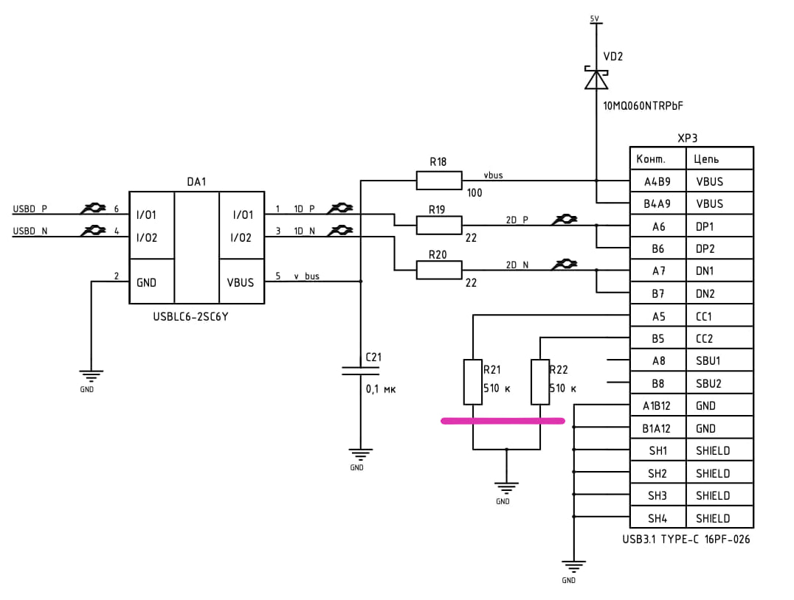

# Примеры USB для K1986BE92FI-Mini

Три USB-прошивки для мк К1986ВЕ92F1I ( MDR1211F1I) на **FreeRTOS** с общей конфигурацией платы и единым скриптом сборки.

## Подготовка

Установите в системе (FreeRTOS уже лежит в репозитории, отдельно ставить не нужно):

| Инструмент          | Зачем                                     |
| ------------------- | ----------------------------------------- |
| `arm-none-eabi-gcc` | Кросс-компилятор GCC                      |
| `cmake`             | Генерация Makefile                        |
| `make`              | Сборка                                    |
| `openocd`           | Прошивка через J-Link (`-f`)              |
| `bc`                | Расчет процентов занимаемой памяти (`-s`) |

## Проблема с резисторами CC



Если планируется подключение кабелем USB-C — USB-C, проверьте номиналы R21 и R22. В схеме/на плате ошибочно стоят 510 кОм, их необходимо заменить на 5.1 кОм (SMD 0603). Без этой замены контроллер порта не перейдет в активный режим.

## Конфигурация платы

Файл [`config.h`](config.h) в корне `usb_examples`:

- `HSE_Value` — частота внешнего кварца (по умолчанию 8 МГц)
- `BOARD_BUTTON`, `BOARD_LED` — пины в формате `PB6` (порт B, вывод 6)

Макросы `MDR_PORTB`, `PORT_Pin_6` и т.п. задаются в [`board_pins.h`](board_pins.h).

## Сборка и прошивка

Из корня `usb_examples`:

```bash
chmod +x build_all.sh
./build_all.sh vcom          # собрать vcom
./build_all.sh keyboard -c   # чистая сборка keyboard
./build_all.sh midi -sf      # размер + прошивка midi
```

Из каталога проекта можно вызвать обёртку (делегирует в общий скрипт):

```bash
./vcom/build_all.sh -csf
```

Флаги: `-c`/`--clean` чистая сборка, `-s`/`--size` отчёт по памяти, `-f`/`--flash` прошивка через J-Link, `-h`/`--help` справка.

## Примеры

| Пример     | Описание                       |
| ---------- | ------------------------------ |
| `vcom`     | USB CDC echo                   |
| `keyboard` | USR Кнопка → HID key `F`, LED  |
| `midi`     | USR Кнопка → MIDI нота A4, LED |

Общий код: `common/` (SPL/CMSIS, startup, тактирование, GPIO, USB), `freertos/` (ядро FreeRTOS).

В каждом примере в `src/sdk/` остаются только настройки SPL под конкретный USB-класс: `MDR32FxQI_config.h` и `MDR32FxQI_usb_handlers.h`.

## Другие проекты

- [Примеры для платы MILUINO](https://github.com/arty1223/MILUINO)
- [Примеры работы с микроконтроллером MDR32F9Q2I (K1986BE92QI)](https://github.com/mdr32/examples/tree/main)
- [Пример проекта для K1986BE92FI (MDR1211FI)](https://github.com/MikhaelKaa/K1986BE92FI_Example)
- [Пример проекта для K1986BE92FI (MDR1211FI) в vs code](https://github.com/Ayrat-Kh/milandr-k1986be92QI)
- [Пример проекта для K1986BE92FI (MDR1211FI) с использованием i2c дисплея 1602](https://github.com/arty1223/MDR1211_lcd1602_i2c)
